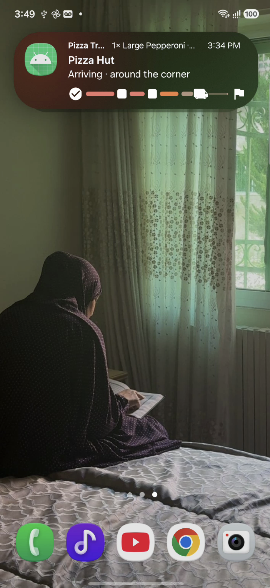
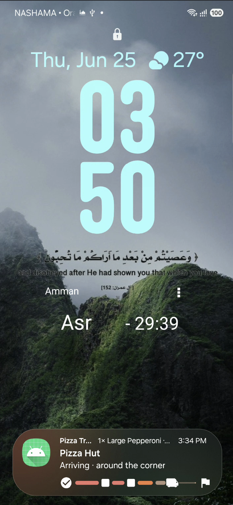
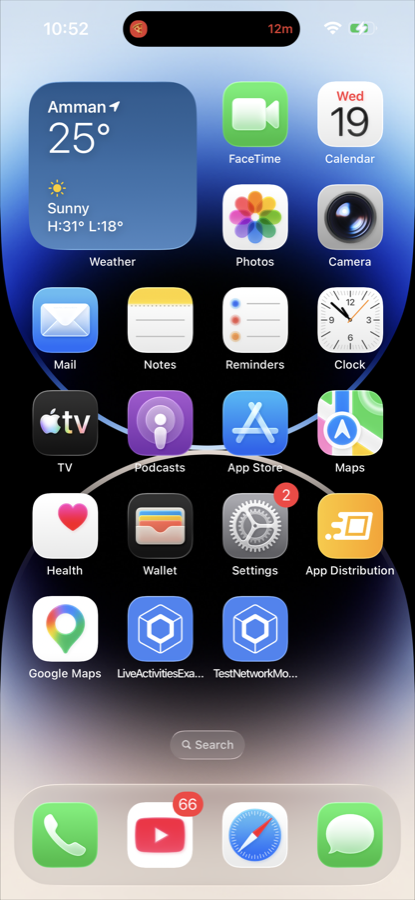
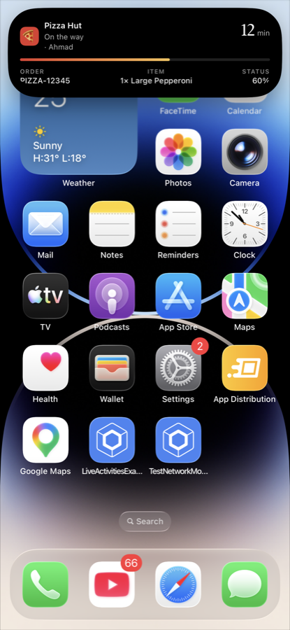

# KMP Live Activities

A Kotlin Multiplatform library that brings **iOS Live Activities** (Dynamic Island + Lock Screen)
and **Android 16 Live Updates** (status-bar chip + top-of-shade) behind a single, unified API.

[](https://central.sonatype.com/artifact/io.github.hazemafaneh.liveactivities/live-activities)
[](https://developer.android.com/about/versions/16)
[](https://developer.apple.com/documentation/activitykit)
[](LICENSE)

> See the [Pizza Delivery example app](https://github.com/HazemAfaneh/LiveActivitiesExample) for a
> full end-to-end integration on both platforms.

---

## Screenshots

<table>
  <tr>
    <th align="center" colspan="2">Android (Samsung Galaxy)</th>
    <th align="center" colspan="2">iOS (Dynamic Island)</th>
  </tr>
  <tr>
    <td align="center"></td>
    <td align="center"></td>
    <td align="center"></td>
    <td align="center"></td>
  </tr>
  <tr>
    <td align="center"><sub>Home screen</sub></td>
    <td align="center"><sub>Lock screen</sub></td>
    <td align="center"><sub>Compact</sub></td>
    <td align="center"><sub>Expanded</sub></td>
  </tr>
</table>

---

## Features

- **One shared API** — `start`, `update`, `end` from your KMP shared module; the library handles each platform.
- **Your UI, fully** — Android notification content is controlled by a renderer you provide; iOS Live Activity UI is written in SwiftUI in your Widget Extension.
- **Push-ready** — APNs push tokens on iOS; a vendor-neutral `LiveActivityPushHandler` for FCM on Android.
- **Typed & safe** — Generic over your own `LiveActivityAttributes` and `LiveActivityContentState`. All failures surface as sealed `Result` values, never thrown.

---

## Requirements

| | Minimum |
|---|---|
| Android (promoted Live Update) | API 36 (Android 16) |
| Android (minSdk / graceful fallback) | API 24 |
| iOS | 16.2 |
| Kotlin | 2.2 |
| AGP | 8.13 |

> **Note:** On Android versions below 16 the library still posts a standard ongoing notification;
> status-bar promotion simply won't occur.

---

## Installation

### Gradle

Add the dependency to your **shared** module and export it for the iOS framework:

```kotlin
// shared/build.gradle.kts
kotlin {
    sourceSets {
        commonMain.dependencies {
            // `api`, not `implementation` — see the note below.
            api("io.github.hazemafaneh.liveactivities:live-activities:0.1.1")
        }
    }

    // Export so the Kotlin types are visible in the iOS framework
    targets.withType<KotlinNativeTarget>().configureEach {
        binaries.withType<Framework>().configureEach {
            export("io.github.hazemafaneh.liveactivities:live-activities:0.1.1")
        }
    }
}
```

> **The dependency must be `api`.** Kotlin/Native only permits `export` for dependencies on a
> source set's API surface. With `implementation` the link step fails:
>
> ```
> Following dependencies exported in the debugFramework binary are not
> specified as API-dependencies of a corresponding source set
> ```
>
> And **without the `export` block** the build succeeds but `LiveActivityManager` and
> `LiveActivityBridge` never reach the generated `Shared.h`, so the Swift bridge below cannot
> see the types it is supposed to implement. If it is not in the header, it is not exported:
>
> ```bash
> grep LiveActivityManager shared/build/bin/iosArm64/debugFramework/Shared.framework/Headers/Shared.h
> ```
>
> Put the dependency in whichever source set your iOS target actually sees — `commonMain` here,
> but an intermediate set such as `mobileMain` works the same way.

### Swift Package (iOS)

In Xcode, **File ▸ Add Package Dependencies…**:

```
https://github.com/HazemAfaneh/kmp-live-activities
```

Rule *Up to Next Major* from `0.1.1` · Product: `KMPLiveActivities`

Add the product to **both** targets:

| Target | Why |
|---|---|
| Your **main app** | The `LiveActivityKitBridge` adapter lives here and imports `KMPLiveActivities`. |
| Your **Widget Extension** | The Lock Screen and Dynamic Island views are built with `KMPLiveActivityWidget` and `KMPLiveActivityAttributes`. |

### Android manifest

The library's manifest merges the foreground service and dismiss receiver automatically.
Your app only needs to declare:

```xml
<!-- Required at runtime on API 33+ -->
<uses-permission android:name="android.permission.POST_NOTIFICATIONS" />

<!-- Normal-protection permission for Android 16 status-bar promotion.
     No runtime request needed; manifest declaration is sufficient. -->
<uses-permission android:name="android.permission.POST_PROMOTED_NOTIFICATIONS" />
```

---

## Quick start

### 1. Define your types in shared code

Both `LiveActivityAttributes` (static, set once) and `LiveActivityContentState`
(dynamic, updated over time) must be annotated with `@Serializable`:

```kotlin
// commonMain
@Serializable
data class OrderAttributes(
    val orderId: String,
    val vendorName: String,
    val itemSummary: String,
) : LiveActivityAttributes

@Serializable
data class OrderState(
    val status: String,          // "preparing" | "on_the_way" | "delivered"
    val etaMinutes: Int,
    val progressPercent: Int,
) : LiveActivityContentState
```

### 2. Android — initialize and register a renderer

```kotlin
class MyApp : Application() {
    override fun onCreate() {
        super.onCreate()
        LiveActivityManager.init(this)

        LiveActivityManager.registerAttributedRenderer(
            stateType = OrderState::class,
            renderer = AttributedLiveActivityRenderer { attributes, state ->
                LiveActivityNotificationContent(
                    title = attributes.vendorName,
                    text  = "ETA ${state.etaMinutes} min · ${statusLabel(state.status)}",
                    subText = attributes.itemSummary,
                    progressStyle = ProgressStyleData(progress = state.progressPercent),
                )
            },
        )
    }
}
```

### 3. iOS — wire up the bridge

In your app's `@main` entry point:

```swift
@main
struct MyApp: App {
    init() {
        if #available(iOS 16.2, *) {
            LiveActivityManager.shared.register(bridge: LiveActivityKitBridge())
        }
    }
    var body: some Scene { WindowGroup { ContentView() } }
}
```

See [iOS bridge adapter](#ios-bridge-adapter) below for the `LiveActivityKitBridge` implementation.

> **Do not skip this, and check it first when nothing appears.** Until `register` runs, every
> call fails with an `IllegalStateException` — *"The KMPLiveActivities Swift package is not
> registered."* If your code drops the returned `Result`, as convenience wrappers often do, the
> only symptom is that no activity ever shows up: no crash, no log, no error.

### 4. Build your Widget Extension

> **One `Widget`, however many activity types you have.** Every activity this library starts is
> backed by the same `KMPLiveActivityAttributes`, whatever your Kotlin attributes type — the
> Kotlin types are carried inside it as JSON. ActivityKit routes to a configuration *by
> attributes type*, so a second `ActivityConfiguration` for a second Kotlin type would collide
> on the same Swift type and one of them would silently never run. Branch on
> `context.attributes.attributesTypeName` instead — see
> [Several activity types](#several-activity-types) below.

```swift
@available(iOS 16.2, *)
struct MyOrderWidget: Widget {
    var body: some WidgetConfiguration {
        KMPLiveActivityWidget.configuration { context in
            let state = try? context.state.decoded(as: OrderStateDTO.self)
            return OrderLockScreenView(state: state)
        } dynamicIsland: { context in
            let state = try? context.state.decoded(as: OrderStateDTO.self)
            return DynamicIsland {
                DynamicIslandExpandedRegion(.center) { Text(state?.status ?? "") }
            } compactLeading: {
                Image(systemName: "bag.fill")
            } compactTrailing: {
                Text("\(state?.etaMinutes ?? 0)m")
            } minimal: {
                Image(systemName: "bag")
            }
        }
    }
}

// Mirror the Kotlin OrderState fields
struct OrderStateDTO: Decodable {
    let status: String
    let etaMinutes: Int
    let progressPercent: Int
}
```

The field names must match your Kotlin content state exactly. kotlinx.serialization applies no
name mapping here, and a mismatch makes `decoded(as:)` return `nil` — which renders as an empty
activity rather than as an error anyone will see.

Register it in a bundle, as usual:

```swift
@main
struct MyAppWidgets: WidgetBundle {
    var body: some Widget {
        MyOrderWidget()
    }
}
```

#### Several activity types

`attributesTypeName` is the fully-qualified name of the Kotlin attributes class the activity was
started with. Switch on it, and decode the payload into whichever DTO matches:

```swift
@available(iOS 16.2, *)
struct MyAppLiveActivity: Widget {
    var body: some WidgetConfiguration {
        KMPLiveActivityWidget.configuration { context in
            switch context.attributes.attributesTypeName {
            case "com.example.OrderAttributes":
                OrderLockScreenView(state: try? context.state.decoded(as: OrderStateDTO.self))
            case "com.example.RideAttributes":
                RideLockScreenView(state: try? context.state.decoded(as: RideStateDTO.self))
            default:
                EmptyView()
            }
        } dynamicIsland: { context in
            // …same switch
        }
    }
}
```

### 5. Start, update, and end

```kotlin
// Start
val activity = LiveActivityManager.start(
    attributes = OrderAttributes(
        orderId     = "ORD-5519",
        vendorName  = "Green Bowl",
        itemSummary = "Falafel wrap × 2",
    ),
    initialState = OrderState(status = "preparing", etaMinutes = 20, progressPercent = 10),
    config = LiveActivityConfig(androidSmallIconResName = "ic_notification"),
).getOrElse { /* handle LiveActivityException */ return }

// Update
LiveActivityManager.update(
    activityId = activity.id,
    newState   = OrderState(status = "on_the_way", etaMinutes = 8, progressPercent = 65),
)

// End (keep visible for 5 seconds)
LiveActivityManager.end(
    activityId      = activity.id,
    dismissalPolicy = DismissalPolicy.After(5.seconds),
)
```

---

## API reference

### `LiveActivityManager`

The single entry point. Every operation returns a `Result`; failures are reported as
`LiveActivityException` inside `Result.failure` and are never thrown.

| Member | Description |
|---|---|
| `activities: StateFlow<List<LiveActivity<*, *>>>` | All tracked activities, including ended ones. |
| `areActivitiesEnabled: StateFlow<Boolean>` | Whether the user permits Live Activities. |
| `start(attributes, initialState, config)` | Creates a new Live Activity. |
| `update(activityId, newState)` | Replaces the content state of a running activity. |
| `end(activityId, dismissalPolicy)` | Ends a single activity. |
| `endAll(dismissalPolicy)` | Ends all running activities. |

### `LiveActivity<A, S>`

A handle to a running activity. Stays usable until `status` reaches `Dismissed`.

| Property | Type | Description |
|---|---|---|
| `id` | `String` | Stable identifier — pass to `update` / `end`. |
| `attributes` | `A` | The static attributes set at start time. |
| `state` | `StateFlow<S>` | The latest content state; emits on every update. |
| `pushToken` | `StateFlow<String?>` | APNs push token (iOS only, when `PushType.Token` is used). Arrives asynchronously. |
| `status` | `StateFlow<LiveActivityStatus>` | Lifecycle state: `Active → Stale → Ended → Dismissed`. The system can end an activity on its own — see [Lifecycle and platform limits](#lifecycle-and-platform-limits). |

### `DismissalPolicy`

| Variant | Behaviour |
|---|---|
| `DismissalPolicy.Immediate` | Remove from screen at once. Default. |
| `DismissalPolicy.After(duration)` | Stay visible for the given duration after ending. |
| `DismissalPolicy.At(instant)` | Stay visible until a specific `Instant`. |

### `LiveActivityConfig`

```kotlin
LiveActivityConfig(
    pushType                = PushType.None,         // or PushType.Token for APNs (iOS)
    staleAfter              = 30.minutes,             // mark Stale if no update arrives
    androidChannelId        = "live_activities",
    androidSmallIconResName = "ic_notification",
    androidConfig = LiveActivityAndroidConfig(
        channelName        = "Order updates",
        channelDescription = "Live order tracking",
        statusChip = StatusChipConfig.Chronometer(
            baseEpochMillis = arrivalEpochMs,
            countDown       = true,
        ),
    ),
)
```

---

## Lifecycle and platform limits

An activity does not only end when you call `end()`. Both platforms retire activities on their
own, and iOS limits how often you may update one. Treat `activity.status` as the source of truth
rather than assuming an activity you started is still alive.

```kotlin
val activity = LiveActivityManager.start(attributes, state).getOrThrow()

scope.launch {
    activity.status.collect { status ->
        when (status) {
            LiveActivityStatus.Active    -> { /* visible, accepting updates */ }
            LiveActivityStatus.Stale     -> { /* iOS only: no update within staleAfter */ }
            LiveActivityStatus.Ended     -> { /* finished, still briefly on screen */ }
            LiveActivityStatus.Dismissed -> { /* gone; the handle is now terminal */ }
        }
    }
}
```

### The system can end an activity without you

| Platform | Behaviour |
|---|---|
| iOS 18+ | The system ends an activity after **12 hours** of active time. |
| iOS 16.2 – 17 | The system ends it after **8 hours**, then leaves it on the Lock Screen for up to 4 more hours (12 hours total) before removing it. |
| iOS (any) | The user can dismiss it from the Lock Screen at any point. |
| Android | A Live Update stays until you end it or the user dismisses the notification. There is no time limit. |

In every case the library reports the transition: on iOS it observes
`Activity.activityStateUpdates` and forwards it, on Android the dismiss receiver does the same.
You will see `Ended` and then `Dismissed` on `status` exactly as if you had called `end()`
yourself. Nothing vanishes silently.

### Update throttling (iOS)

ActivityKit gives each app a budget for how frequently it may refresh an activity. Exceeding it
is not fatal, but the system may drop or defer updates, and a `start` rejected for budget reasons
comes back as `LiveActivityException.BudgetExceeded`.

A throttled `update()` has **no** failure path — ActivityKit accepts the call and the system
decides whether to render it. Design for update rates measured in minutes, not seconds. Anything
that changes every tick — a countdown, an elapsed timer — should render itself rather than be
pushed through `update()`: use `StatusChipConfig.Chronometer` on Android and a relative-date
`Text` in your SwiftUI view on iOS. If you need frequent *push* updates, add
`NSSupportsLiveActivitiesFrequentUpdates` to your app's `Info.plist`; the budget still applies.

Android has no equivalent throttle, but each update re-posts a notification, so the same advice
about update frequency holds for battery reasons.

### Platform differences worth knowing

| | iOS | Android |
|---|---|---|
| `staleAfter` / `Stale` status | Supported; maps to ActivityKit's `staleDate`. | Ignored; `Stale` is never emitted. |
| Maximum active duration | 12 hours (8 on iOS 17 and earlier). | Unlimited. |
| Content state size | 4 KB, enforced by the system. | No hard limit. |
| Push updates | Per-activity APNs token (see below). | FCM data message via `LiveActivityPushHandler`. |

---

## Android notification content

Your renderer returns a `LiveActivityNotificationContent` that the library converts into a
`NotificationCompat.ProgressStyle` notification — the style Android 16 requires for
status-bar promotion.

| Field | Type | Notes |
|---|---|---|
| `title` | `String` | Bold first line. Falls back to the app name if blank. |
| `text` | `String` | Main notification body text. |
| `progressStyle` | `ProgressStyleData?` | Enables Android 16 promotion. Supports segments, points, and start/end icons. |
| `subText` | `String?` | Short text next to the app name. |
| `statusChip` | `StatusChipConfig?` | `CriticalText(text)` or `Chronometer(baseEpochMillis, countDown)`. |
| `accentColor` | `@ColorInt Int?` | Tints the app name and small-icon background. |
| `contentIntent` | `PendingIntent?` | Tap action. Defaults to the launcher activity. Supply a custom intent to deep-link into a specific screen. |

### Renderers

| Type | When to use |
|---|---|
| `LiveActivityRenderer<S>` | You only need the dynamic state to render content. |
| `AttributedLiveActivityRenderer<A, S>` | You also need the static attributes (vendor name, order ID, etc.). |
| `DefaultProgressRenderer<S>` | Pre-built renderer; pass lambdas for each field to avoid boilerplate. |

---

## Remote push updates

### What an update does

An update — local `update()` or a push — **replaces the existing activity in place**. It never
creates a second notification or a second activity.

On Android each activity owns one notification id, assigned at `start()` and kept for the
activity's whole life. Every update re-renders the content and re-posts under that same id, so
the system swaps the content of the row already on screen. The notification is built with
`setOnlyAlertOnce(true)`, so only the first post alerts: updates arrive silently, with no sound,
vibration, or repeated heads-up peek. The id is persisted alongside the activity, so a push that
lands after process death still updates the original notification rather than posting a new one.

On iOS the update is forwarded to ActivityKit's `Activity.update` for that same activity
instance, so the Lock Screen and Dynamic Island presentations refresh in place.

Consequences worth designing for:

- **Push cannot start an activity.** `handleStateUpdate` looks the activity up by id; an unknown
  id fails with `LiveActivityException.ActivityNotFound` and nothing is posted. Only `start()`
  creates one.
- **A dismissed activity stops accepting updates.** When the user swipes the notification away,
  the library flips it to `Dismissed` and drops it from tracking, so later pushes for that id
  return `ActivityNotFound`. It is deliberately not re-posted — reviving it is your call.
- **The state type is fixed at `start()`.** A push payload is decoded into the content-state type
  the activity was started with. A payload that doesn't match the schema fails with
  `LiveActivityException.SerializationFailed` and the notification stays on its last good state.
- **iOS rejects oversized payloads before rendering.** A content state above the 4 KB system limit
  fails with `LiveActivityException.PayloadTooLarge`; the visible activity is left untouched.

### Android (FCM)

The library has no FCM dependency. Call `LiveActivityPushHandler` from your existing messaging service:

```kotlin
class MyMessagingService : FirebaseMessagingService() {
    override fun onMessageReceived(message: RemoteMessage) {
        val activityId = message.data["activityId"] ?: return
        val stateJson  = message.data["state"]      ?: return
        runBlocking {
            LiveActivityPushHandler.handleStateUpdate(activityId, stateJson)
        }
    }
}
```

`stateJson` must be the kotlinx.serialization output of your `LiveActivityContentState` type —
the same schema the library produces when calling `update()` locally.

### iOS (APNs)

This token is **per activity**, not your app's APNs device token. Every activity gets its own,
it can be reissued while the activity runs, and it only arrives after `start` returns — so collect
it from the flow and register it against `activity.id` rather than reading it once.

Request one with `pushType = PushType.Token`, then observe it on the activity handle:

```kotlin
val activity = LiveActivityManager.start(
    attributes   = attributes,
    initialState = initialState,
    config = LiveActivityConfig(pushType = PushType.Token),
).getOrElse { return }

// Collect the token and register it with your server
activity.pushToken.filterNotNull().first().let { token ->
    myServer.registerPushToken(activityId = activity.id, token = token)
}
```

---

## Error handling

All operations return `Result<T>`. Failures are sealed subclasses of `LiveActivityException`
and are never thrown across the public API:

```kotlin
LiveActivityManager.start(attributes, state)
    .onSuccess { activity -> /* running */ }
    .onFailure { error ->
        when (error) {
            is LiveActivityException.NotAuthorized          -> { /* prompt user */ }
            is LiveActivityException.NotSupportedOnPlatform -> { /* skip gracefully */ }
            is LiveActivityException.BudgetExceeded         -> { /* too many active (iOS) */ }
            is LiveActivityException.PayloadTooLarge        -> { /* trim your state */ }
            is LiveActivityException.ActivityNotFound       -> { /* stale id */ }
            is LiveActivityException.SerializationFailed    -> { /* check @Serializable */ }
            else                                            -> { /* log */ }
        }
    }
```

| Exception | Cause |
|---|---|
| `NotAuthorized` | User disabled Live Activities (iOS) or `POST_NOTIFICATIONS` not granted (Android 13+). |
| `NotSupportedOnPlatform` | Runtime OS below iOS 16.2 or Android 16. |
| `BudgetExceeded` | iOS rejected: too many Live Activities already running. |
| `PayloadTooLarge` | Serialized state exceeds 4 KB (iOS limit). Slim down your content state. |
| `ActivityNotFound` | No running activity matches the id. |
| `SerializationFailed` | Attributes or state not annotated with `@Serializable`. |

---

## iOS bridge adapter

Create a Swift adapter in your **main app target** that wires `KMPLiveActivityController`
to the Kotlin `LiveActivityBridge` protocol:

```swift
// LiveActivityKitBridge.swift — main app target
import KMPLiveActivities
import shared // your KMP shared module

@available(iOS 16.2, *)
final class LiveActivityKitBridge: LiveActivityBridge {

    init() {
        let c = KMPLiveActivityController.shared
        c.onStartResult  = { id, ok, err in
            LiveActivityManager.shared.notifyStartResult(activityId: id, success: ok, errorKind: err)
        }
        c.onPushToken    = { id, tok in
            LiveActivityManager.shared.notifyPushToken(activityId: id, token: tok)
        }
        c.onStatusChanged = { id, s in
            LiveActivityManager.shared.notifyStatusChanged(activityId: id, status: s)
        }
    }

    func areActivitiesEnabled() -> Bool { KMPLiveActivityController.shared.areActivitiesEnabled }

    func start(activityId: String, attributesTypeName: String, attributesJson: String,
               contentStateJson: String, staleAfterSeconds: Double, requestPushToken: Bool) {
        KMPLiveActivityController.shared.start(
            activityId: activityId, attributesTypeName: attributesTypeName,
            attributesJson: attributesJson, contentStateJson: contentStateJson,
            staleAfterSeconds: staleAfterSeconds, requestPushToken: requestPushToken)
    }

    func update(activityId: String, contentStateJson: String, staleAfterSeconds: Double) {
        KMPLiveActivityController.shared.update(
            activityId: activityId, contentStateJson: contentStateJson,
            staleAfterSeconds: staleAfterSeconds)
    }

    func end(activityId: String, finalContentStateJson: String?, dismissalSeconds: Double) {
        KMPLiveActivityController.shared.end(
            activityId: activityId, finalContentStateJson: finalContentStateJson,
            dismissalSeconds: dismissalSeconds)
    }
}
```

---

## Example app

[**LiveActivitiesExample**](https://github.com/HazemAfaneh/LiveActivitiesExample) is a full KMP
project (Android + iOS) showing a **pizza delivery tracker** that moves through all four delivery
stages: *Preparing → On the way → Arriving → Delivered*.

It demonstrates:

- Defining shared `LiveActivityAttributes` and `LiveActivityContentState` models in `commonMain`
- Starting, updating, and ending a `LiveActivity` from shared Compose UI
- The `LiveActivityKitBridge` Swift adapter wiring `KMPLiveActivityController` to the Kotlin protocol
- A SwiftUI Widget Extension with Lock Screen and Dynamic Island views
- Decoding the JSON payload into Swift DTOs to drive the UI

---

## License

```
Copyright 2026 Hazem Afaneh

Licensed under the Apache License, Version 2.0 (the "License");
you may not use this file except in compliance with the License.
You may obtain a copy of the License at

    https://www.apache.org/licenses/LICENSE-2.0
```
